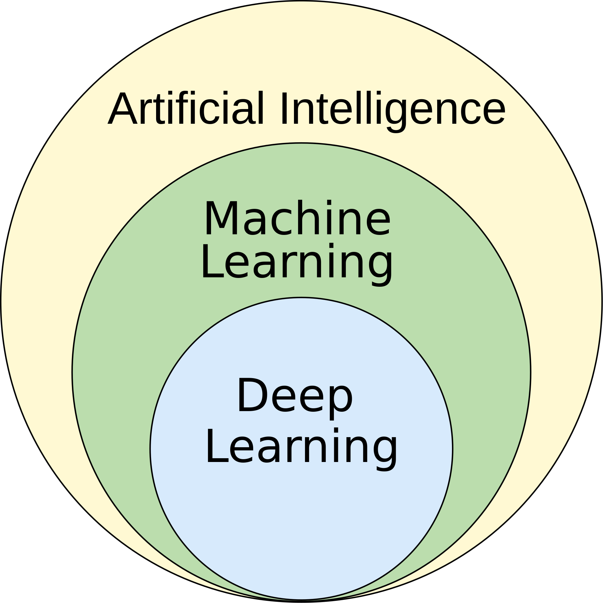

# What is Artificial Intelligence? A Historical and Conceptual Introduction

## Defining Intelligence: The Quest to Emulate the Human Mind

Artificial Intelligence (AI) is a broad and ambitious field of computer science dedicated to creating systems capable of performing tasks that typically require human intelligence. These tasks include reasoning, learning, problem-solving, perception, understanding language, and even creativity.

At its core, AI is not just about processing data but about **emulating cognition**. The ultimate goal is to build machines that can think, learn, and adapt in ways that are indistinguishable from, or even superior to, human capabilities.

### The Turing Test: A Benchmark for Intelligence

In 1950, Alan Turing proposed a simple but powerful test to measure a machine's ability to exhibit intelligent behavior equivalent to, or indistinguishable from, that of a human. In the **Turing Test**, a human evaluator engages in a natural language conversation with both a human and a machine. If the evaluator cannot reliably tell the machine from the human, the machine is said to have passed the test.

## A Brief History of AI

The dream of creating artificial beings is ancient, but the scientific journey of AI began in the mid-20th century.

- **1956: The Dartmouth Workshop - The Birth of a Field**: The term "Artificial Intelligence" was coined by John McCarthy at a summer workshop at Dartmouth College. This event brought together the founding fathers of AI and laid out the vision for the field. The initial optimism was immense, with pioneers predicting that machines with human-level intelligence were just a few decades away.

- **The "AI Winters": Cycles of Hype and Disillusionment**: The history of AI has been marked by periods of intense funding and excitement ("AI summers") followed by "AI winters," where progress stalled, and funding dried up. These cycles were often caused by:
    - **Overblown Promises**: Early researchers underestimated the profound difficulty of tasks like computer vision and natural language understanding.
    - **Computational Limits**: The hardware of the time was insufficient to handle the complexity of the proposed models.
    - **The Combinatorial Explosion**: Many early AI approaches were based on exploring vast search spaces of possibilities, which quickly became computationally intractable.

- **2012-Present: The Deep Learning Revolution**: The current "AI summer" was ignited by the convergence of three key factors:
    1.  **Big Data**: The availability of massive datasets to train complex models.
    2.  **Powerful Hardware**: The rise of GPUs (Graphics Processing Units) provided the parallel computing power needed for deep learning.
    3.  **Algorithmic Breakthroughs**: Innovations like the backpropagation algorithm and new neural network architectures (e.g., AlexNet in 2012) unlocked unprecedented performance.

This revolution shifted the dominant paradigm from rule-based systems to **machine learning**, where systems learn directly from data.

## Machine Learning vs. Artificial Intelligence

While often used interchangeably, **Machine Learning (ML)** is a subfield of AI that is easier to define. It focuses on building systems that can **learn from data**, identify patterns, and make decisions with minimal human intervention.

Instead of being explicitly programmed with rules to solve a problem, a machine learning model learns its own algorithm by analyzing and finding patterns in data. The more data it is exposed to, the better the model becomes.

A couple of classic definitions are:

> [Machine learning is the] field of study that gives computers the ability to learn without being explicitly programmed.
>
> — Arthur Samuel, 1959

> A computer program is said to learn from experience E with respect to some class of tasks T and performance measure P if its performance at tasks in T, as measured by P, improves with experience E.
>
> — Tom Mitchell, 1997

### Deep Learning

**Deep Learning** is a specialized subfield of machine learning that uses **artificial neural networks** with many layers (hence "deep"). By leveraging deep architectures, these models can learn complex, hierarchical patterns from vast amounts of data. This has led to breakthroughs in fields like computer vision and natural language processing.

## The Spectrum of AI: From Narrow to General Intelligence

AI systems can be categorized based on their capabilities and level of "consciousness."

### Weak AI (Narrow AI)

**Weak AI**, also known as **Artificial Narrow Intelligence (ANI)**, refers to AI systems designed and trained to perform a **specific, well-defined task**. This is the form of AI that surrounds us today.

- **Characteristics**:
    - **Task-Specific**: Excels at one job (e.g., playing chess, recognizing faces, filtering spam).
    - **No Consciousness or Self-Awareness**: It operates within a pre-determined range and does not possess genuine understanding or consciousness.
    - **Data-Driven**: Its performance is directly tied to the quality and quantity of the data it was trained on.

- **Examples**:
    - **Siri, Alexa, and Google Assistant**: Voice-activated assistants that understand and respond to a limited set of commands.
    - **Recommendation Engines**: Algorithms on Netflix or Amazon that suggest content based on your viewing history.
    - **Self-Driving Cars**: Highly complex systems, but still narrow AI focused on the task of driving.

### Strong AI (General AI or AGI)

**Strong AI**, or **Artificial General Intelligence (AGI)**, is the hypothetical intelligence of a machine that has the capacity to understand, learn, and apply its intelligence to solve **any intellectual task that a human being can**.

- **Characteristics**:
    - **Human-Level Cognition**: Possesses the ability to reason, plan, learn from experience, think abstractly, and understand complex ideas.
    - **Consciousness and Self-Awareness**: A true AGI would likely have some form of consciousness and subjective experience (though this is a topic of intense philosophical debate).
    - **Adaptability**: Can transfer knowledge from one domain to another and learn new tasks without being explicitly reprogrammed.

**AGI remains the holy grail of AI research and does not yet exist.**

### Artificial Superintelligence (ASI)

**Artificial Superintelligence (ASI)** is a hypothetical form of AI that surpasses human intelligence in virtually every domain, including scientific creativity, general wisdom, and social skills. The development of ASI raises profound ethical and existential questions for the future of humanity.

