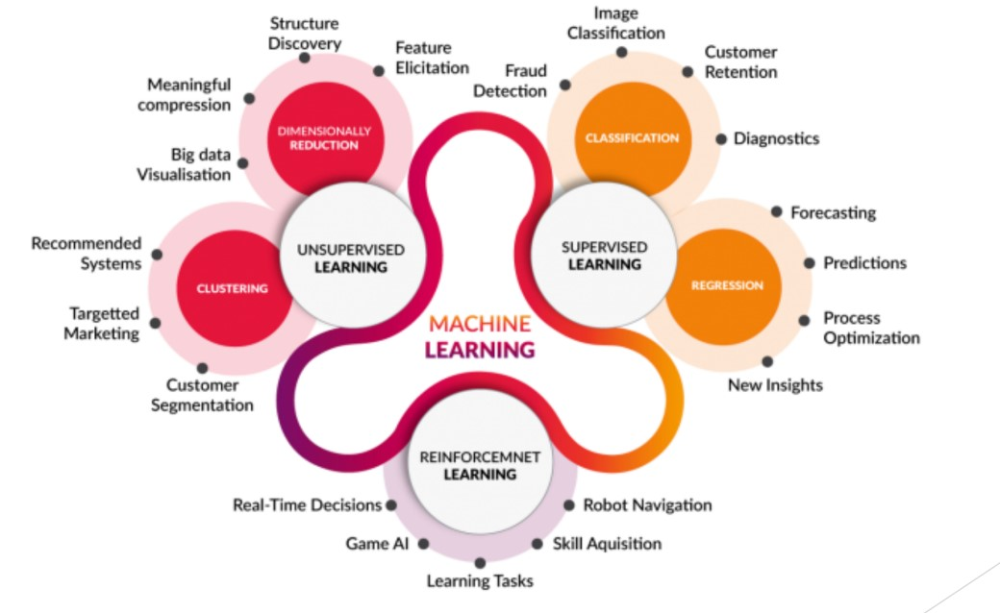
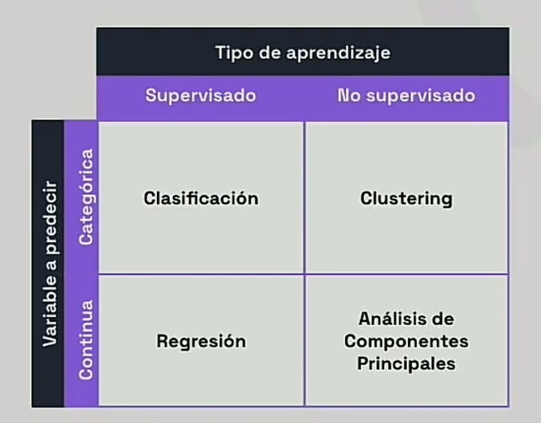
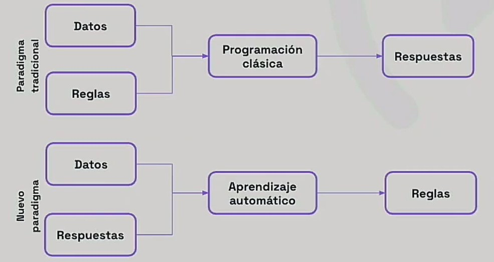
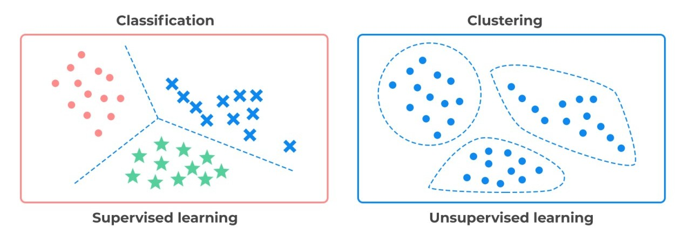
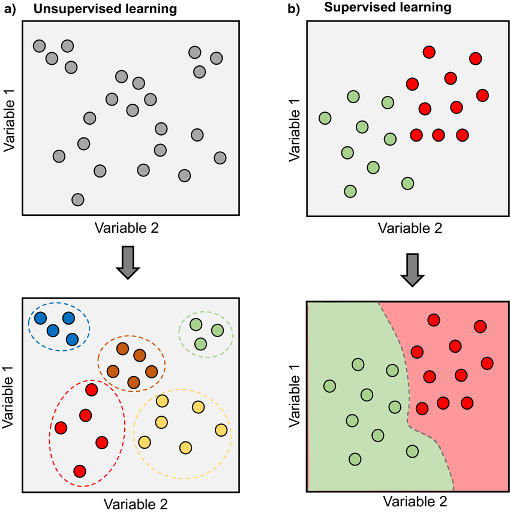

# Machine Learning Paradigms

Machine learning enables systems to learn from data, identify patterns, and make decisions with minimal human intervention. Unlike traditional programming, where programs are designed with explicit rules, ML builds models by learning from data.

> [Models to understand a chaotic reality | DotCSV](https://www.youtube.com/watch?v=Sb8XVheowVQ)

A **model** is an abstract, articulated description of a reality. In machine learning, models are what we **train** with data using a learning algorithm. The model learns to adjust itself to a large number of examples and is then used to predict the correct response for new, unseen input data.

The way a model learns is defined by its learning paradigm, which is classified based on the type of supervision or feedback it receives during training.

> [What is Supervised and Unsupervised Learning? | DotCSV](https://www.youtube.com/watch?v=oT3arRRB2Cw)

## Supervised Learning

In supervised learning, the training dataset is **labeled with the correct answer**. The learning algorithm receives a set of training data and, knowing the correct answer for each example, infers a model that generates that answer.

### Classification

A typical supervised learning task is **classification**. Consider a spam filter: an algorithm can learn by examining many examples of emails already labeled as "spam" or "not spam." It might infer that certain words are almost always associated with spam, while emails from specific senders are never spam. The more labeled examples the algorithm is trained on, the better it becomes at filtering spam.

Another example is handwritten digit recognition, where the algorithm receives images of digits and must classify them from 0 to 9.

Types of classification:
- **Binary**: The output has two classes (e.g., spam/not spam, positive/negative).
- **Multiclass**: The output has more than two classes (e.g., digit recognition, image classification).
- **Multilabel**: An instance can be assigned multiple labels (e.g., tagging music with genres).

### Regression

In **regression** problems, the goal is to predict a **continuous value**. For example, predicting the price of a house based on its features (number of rooms, garden size, location, etc.). In this case, instead of a class label, each example is labeled with a numerical value (the price of the house).

## Unsupervised Learning

In unsupervised learning, the training dataset is **not labeled**. The goal is to discover hidden patterns or intrinsic structures in the data.

### Clustering

**Clustering** involves grouping data points into clusters based on similarity. An example is customer segmentation, where customers are grouped into similar segments to better tailor products and services. This is used in recommendation systems, marketing, and more.

### Association Rule Mining

While clustering groups instances (like customers), **association rule mining** discovers relationships between items. For example, identifying that customers who buy bread also tend to buy butter ("market basket analysis").

### Dimensionality Reduction

**Dimensionality reduction** aims to reduce the number of variables (features) in a dataset. This is useful when dealing with high-dimensional data where some features may be redundant or irrelevant. It can reduce training time and improve model accuracy. A common technique is **Principal Component Analysis (PCA)**.

### Anomaly Detection

This task focuses on identifying unusual data points or patterns that deviate significantly from the norm. It is used in fraud detection, system monitoring, and security to flag data that could indicate errors or attacks.

## Reinforcement Learning

In **reinforcement learning**, an **agent** learns by interacting with an **environment**. The agent performs actions, and the environment provides feedback in the form of **rewards** or **penalties**. The agent's goal is to learn a **policy** (a strategy for choosing actions) that maximizes its cumulative reward over time.

This paradigm is found in robotics (e.g., teaching a robot to walk) and games (e.g., training an AI to play chess or Go).
