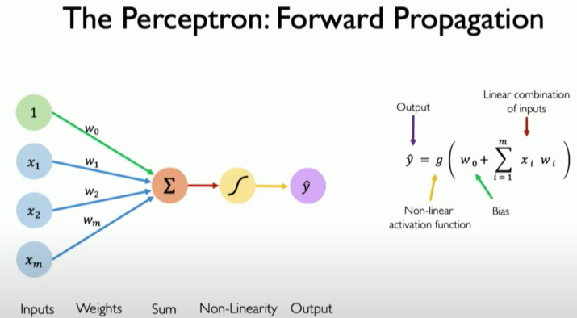
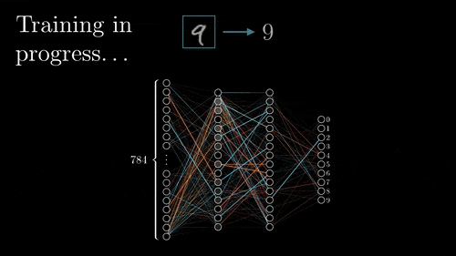
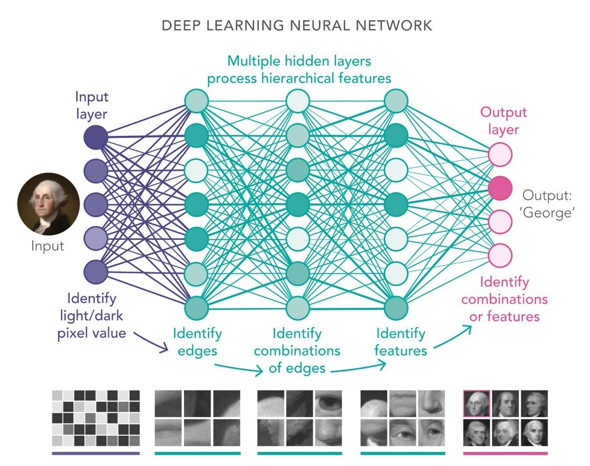

# Neural Networks and Deep Learning

## Historical milestones

### Early foundations (1943–2011)

- 1943: McCulloch and Pitts propose the first mathematical model of a neuron.
- 1958: Frank Rosenblatt develops the **Perceptron**, considered the first implemented neural network.
- 1969: Minsky and Papert publish "Perceptrons," demonstrating the limitations of the simple perceptron, which led to the "AI winter."
- 1986: Hinton, Rumelhart, and Williams publish the ***backpropagation*** algorithm, which **allows training multilayer neural networks**.
- 1988: LeCun et al. present the first convolutional neural network model for handwritten character recognition (MNIST).
- 1997: Hochreiter & Schmidhuber introduce **LSTMs** (Long Short-Term Memory), fundamental for processing sequences and time series.

### The AI Boom (2012-present)

- Causes:
    - Increased computing power (GPUs, TPUs)
    - Availability of huge datasets (Internet, Big Data)
    - Advances in algorithms and network architectures
    - Huge increase in funding and industrial investment

- Main milestones:
    - 2012: **AlexNet** (Krizhevsky, Sutskever, and Hinton) reduces the error on **ImageNet** to 15.3% (from 26%), demonstrating the power of CNNs and marking the beginning of the boom.
    - 2014: Facebook's **DeepFace** achieves near-human accuracy (97.35%) in facial recognition.
    - 2014: Ian Goodfellow introduces **GANs** (Generative Adversarial Networks), revolutionizing content generation.
    - 2015: **ResNet** from Microsoft Research introduces residual connections, allowing the training of networks with over 100 layers.
    - 2016: DeepMind's **AlphaGo** defeats world champion Lee Sedol using deep neural networks trained with supervised and reinforcement learning with advanced Monte Carlo tree search techniques. ([Documentary](https://www.youtube.com/watch?v=WXuK6gekU1Y)).
    - 2017: The **Transformer** architecture appears with the publication of "**Attention is all you need**" by Google Brain, transforming language processing.
    - 2018: Google's **BERT** sets new records in natural language understanding.
    - 2020: OpenAI's **GPT-3** demonstrates emerging capabilities in large-scale language models.
    - 2021: **Diffusion models** (DALL-E, GLIDE) begin to dominate realistic image generation.
    - 2022: OpenAI's **ChatGPT** (GPT-3.5) popularizes conversational assistants.
    - 2023: OpenAI's **GPT-4o** and the proliferation of **multimodal** models (text, image, audio, video).
    - 2024: First models with advanced reasoning capabilities (**OpenAI o1**).
    - 2025: **DeepSeek-R1** (*open-weights*) lowers the cost of language models with performance similar to o1.

## The Perceptron: The Artificial Neuron

The perceptron is the fundamental unit of a neural network, inspired by the basic functioning of a biological neuron. It's the simplest form of a neural network, which in many ways, laid the groundwork for more complex networks.

> [What is a Neural Network? Part 1: The Neuron | DotCSV](https://www.youtube.com/watch?v=MRIv2IwFTPg&list=PL-Ogd76BhmcC_E2RjgIIJZd1DQdYHcVf0&index=7)

> [ChatGPT is made from 100 million of these [The Perceptron]](https://www.youtube.com/watch?v=l-9ALe3U-Fg)

### Structure of the Perceptron

A perceptron takes several binary inputs and produces a single binary output. It works by weighing the importance of each input and, if the sum of the weighted inputs surpasses a certain threshold, it "fires" (outputs a 1). Otherwise, it doesn't (outputs a 0).

A perceptron consists of:
1.  **Inputs**: Numerical values that represent features of the data.
2.  **Weights**: Values that determine the importance of each input. A higher weight means the input has more influence on the output.
3.  **Bias**: An additional parameter that allows adjusting the activation threshold, making the model more flexible.
4.  **Weighted Sum**: The inputs are multiplied by their corresponding weights and summed up.
5.  **Activation Function**: This function decides whether the neuron should be activated or not based on the weighted sum. In a simple perceptron, this is a simple step function.

### Limitations of the Simple Perceptron

The simple perceptron can only solve linearly separable problems. This means it can classify data that can be separated by a single straight line. It can learn simple logical operations like AND and OR, but it famously fails with the XOR operation, which is not linearly separable. This limitation led to a period of reduced interest in neural networks, known as the "AI winter."

## Multilayer Neural Networks (MLP)

To overcome the limitations of the simple perceptron, researchers developed multilayer neural networks, also known as Multilayer Perceptrons (MLPs). These networks consist of multiple layers of perceptrons, allowing them to learn much more complex patterns.

> [3Blue1Brown - But what is a neural network?](https://www.youtube.com/watch?v=aircAruvnKk&list=PLZHQObOWTQDNU6R1_67000Dx_ZCJB-3pi)

### Structure of a Multilayer Neural Network

A multilayer neural network contains:
1.  **Input layer**: Receives the initial data.
2.  **Hidden layers**: One or more layers that perform internal transformations on the data. These are the key to learning complex, non-linear relationships.
3.  **Output layer**: Produces the final result (e.g., a classification or a regression value).

### Why do we need hidden layers?

Hidden layers allow the network to learn hierarchical features. Each layer learns to recognize certain patterns in the data, and subsequent layers combine these patterns to learn even more complex representations. This is what gives deep learning its power.

## Activation Functions

Activation functions are a crucial component of neural networks. They introduce non-linearity into the model, which is what allows the network to learn from data that is not linearly separable. Without them, a neural network would just be a linear model, no matter how many layers it has.

### Main Activation Functions

1.  **Sigmoid**: Compresses any input into a range between 0 and 1. It's often used in the output layer for binary classification problems.
2.  **Hyperbolic Tangent (tanh)**: Similar to the sigmoid, but it compresses values into a range between -1 and 1.
3.  **ReLU (Rectified Linear Unit)**: This is one of the most popular activation functions in modern deep learning. It's very simple: it outputs the input if it's positive, and 0 otherwise. It's computationally efficient and helps mitigate the "vanishing gradient" problem.
4.  **Softmax**: Often used in the output layer for multiclass classification problems. It converts a vector of raw scores into a probability distribution, where each value represents the probability of the input belonging to a certain class.

## Training: **Gradient Descent**

> [What is Gradient Descent? Artificial Intelligence Algorithm | DotCSV](https://www.youtube.com/watch?v=A6FiCDoz8_4)

> [3Blue1Brown - Gradient descent, how neural networks learn](https://www.youtube.com/watch?v=IHZwWFHWa-w&list=PLZHQObOWTQDNU6R1_67000Dx_ZCJB-3pi&index=2)

Training a neural network is the process of finding the optimal weights and biases that allow the network to make accurate predictions. This is done by minimizing a **loss function**, which measures how far the model's predictions are from the actual correct values.

The most common optimization algorithm used to train neural networks is **Gradient Descent**. It works by iteratively adjusting the model's parameters (weights and biases) in the direction that reduces the loss.

1.  **Key concepts**:
    -   **Gradient**: A vector that points in the direction of the steepest ascent of the loss function. To minimize the loss, we move in the opposite direction of the gradient.
    -   **Learning rate**: A small value that controls the size of the steps we take during optimization. A learning rate that is too high can cause the model to overshoot the optimal solution, while one that is too low can make the training process very slow.

2.  **Process**:
    -   The model makes a prediction (this is called the *forward pass*).
    -   The loss is calculated by comparing the prediction with the actual value.
    -   The gradient of the loss with respect to each parameter is calculated.
    -   The parameters are updated by taking a small step in the opposite direction of the gradient.

3.  **Variants**:
    -   **Batch Gradient Descent**: Uses the entire dataset to compute the gradient at each step. It's slow and memory-intensive for large datasets.
    -   **Stochastic Gradient Descent (SGD)**: Uses a single randomly selected data point to compute the gradient at each step. It's much faster but can be noisy.
    -   ***Mini-batch Gradient Descent***: A compromise between the two. It uses a small, random batch of data to compute the gradient. This is the most common approach in deep learning.

## ***Backpropagation***

Backpropagation is the algorithm that allows us to efficiently train deep, multi-layer neural networks. It's the engine that powers modern deep learning.

> [What is a Neural Network? Part 3: Backpropagation | DotCSV](https://www.youtube.com/watch?v=eNIqz_noix8&list=PL-Ogd76BhmcC_E2RjgIIJZd1DQdYHcVf0&index=10)

> [3Blue1Brown - Backpropagation](https://www.youtube.com/watch?v=Ilg3gGewQ5U&list=PLZHQObOWTQDNU6R1_67000Dx_ZCJB-3pi&index=3)

### How does it work?

1.  **Forward Pass**: The network calculates its output for a given input, passing the data from the input layer through the hidden layers to the output layer.
2.  **Error Calculation**: The output is compared with the correct value to calculate the error or loss.
3.  **Backward Pass**: The error is propagated backward through the network, from the output layer to the input layer. During this process, the algorithm calculates how much each weight and bias contributed to the overall error.
4.  **Weight Update**: The weights and biases are adjusted based on their contribution to the error, using an optimization algorithm like Gradient Descent.

The mathematical foundation of backpropagation is the **chain rule** from calculus, which allows it to efficiently compute the gradients for all the parameters in the network.

## ***Deep Learning***

*Deep learning* refers to neural networks with many hidden layers (hence "deep"). These deep architectures allow the models to learn representations of data at various levels of abstraction.

### Advantages of Deep Learning

1.  **Automatic feature learning**: Unlike traditional machine learning, where feature engineering is often a manual and time-consuming process, deep learning models can learn the relevant features directly from the data.
2.  **Ability to model complex relationships**: Deep learning excels at modeling complex, non-linear relationships, making it particularly powerful for unstructured data like images, text, and sound.
3.  **Transferability**: Knowledge learned from one task can often be transferred to another. This is known as **transfer learning**, and it allows us to build powerful models even with limited data.

### Popular Deep Learning Architectures

1.  **Convolutional Neural Networks (CNNs)**: Specialized for processing grid-like data, such as images. They use convolutional layers to detect spatial patterns like edges, textures, and shapes.
2.  **Recurrent Neural Networks (RNNs) and LSTM/GRU**: Designed for sequential data, like time series or text. They have a form of "memory" that allows them to maintain information about previous inputs in the sequence.
3.  **Transformers**: A more modern architecture, also designed for sequential data, that has revolutionized natural language processing. It uses a mechanism called "attention" to weigh the importance of different parts of the input data. Models like BERT and GPT are based on the Transformer architecture.
4.  **Generative Adversarial Networks (GANs)**: Consist of two networks, a generator and a discriminator, that compete against each other. They are used to generate new, synthetic data that is similar to the training data (e.g., creating realistic images).
5.  **Autoencoders**: Used for unsupervised learning, typically for dimensionality reduction or anomaly detection. They learn to compress data into a smaller representation and then reconstruct it back to its original form.
