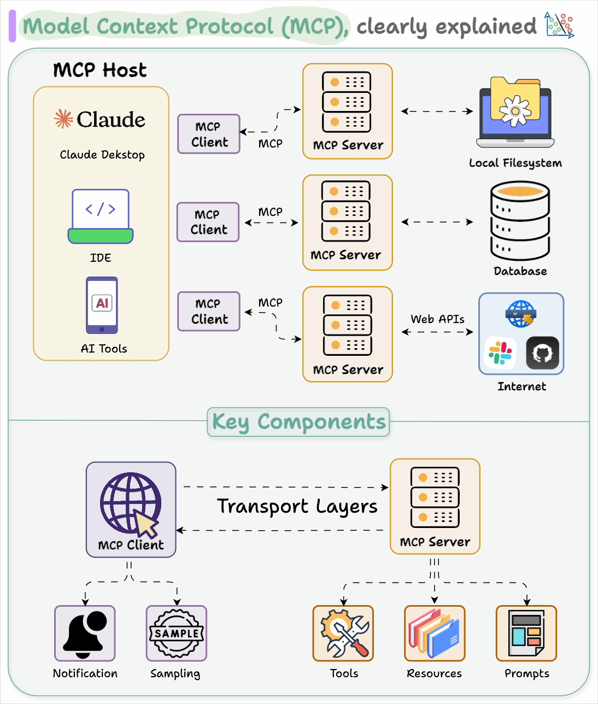

# The Generative AI Revolution

While traditional AI (or "predictive AI") is focused on analyzing existing data to make predictions or classifications, **Generative AI** is about creating **new, original content**. This marks a fundamental shift from understanding the world to creating within it.

Generative models learn the underlying patterns and structure of a dataset and then use that knowledge to produce novel artifacts that are similar to, but distinct from, the training data.

## Key Generative Architectures

Several powerful architectures have driven the generative AI boom.

### 1. Generative Adversarial Networks (GANs)

- **Concept**: GANs consist of two neural networks, a **Generator** and a **Discriminator**, locked in a competitive game.
    - The **Generator** creates fake data (e.g., images, text).
    - The **Discriminator** tries to distinguish between real data and the fake data created by the generator.
- **The Game**: The generator's goal is to fool the discriminator, while the discriminator's goal is to get better at catching fakes. Through this adversarial process, the generator becomes progressively better at creating realistic content.
- **Impact**: GANs revolutionized image generation, enabling the creation of photorealistic faces, art, and other visual content.

### 2. Variational Autoencoders (VAEs)

- **Concept**: VAEs are an extension of autoencoders. They learn to compress data into a structured, lower-dimensional "latent space" and then reconstruct it.
- **Generative Process**: By sampling points from this learned latent space, a VAE can generate new data. The structure of the latent space allows for smooth interpolation between different data points (e.g., morphing one face into another).
- **Use Cases**: VAEs are used for image generation, data augmentation, and anomaly detection.

### 3. Diffusion Models

- **Concept**: Diffusion models work by systematically adding noise to an image until it becomes pure static, and then learning how to reverse the process.
- **The Reversal**: The model learns to gradually remove the noise, step-by-step, to recover a clean image from a random noise input. By controlling the process with text prompts or other inputs, it can generate highly specific and detailed images.
- **Impact**: Diffusion models are the state-of-the-art for image generation, powering models like **DALL-E 2/3, Midjourney, and Stable Diffusion**. They produce images of stunning quality and coherence.

### 4. Transformers and Large Language Models (LLMs)

- **Concept**: The **Transformer architecture**, introduced in the 2017 paper "Attention Is All You Need," revolutionized how we process sequential data like text. Its key innovation is the **self-attention mechanism**, which allows the model to weigh the importance of different words in a sequence when processing it.
- **Large Language Models (LLMs)**: By scaling up Transformer models to billions of parameters and training them on vast amounts of text data from the internet, researchers created LLMs like **GPT (Generative Pre-trained Transformer)**.
- **How they work**: LLMs are fundamentally **next-token predictors**. Given a sequence of text, they predict the most probable next word or character. By repeatedly doing this, they can generate long, coherent passages of text.
- **Impact**: LLMs have unlocked a huge range of applications, from chatbots and content creation to code generation and scientific discovery. They represent a major step towards more general artificial intelligence.

## Practical LLM application patterns

- Prompting and system instructions: control behavior with clear roles, constraints, and examples (few-shot).
- Function calling / tool use: constrain outputs to JSON schemas and call external tools safely.
- Retrieval-Augmented Generation (RAG): enrich prompts with retrieved context from private data (see below).
- Guardrails and validation: schema validation, content filters, and safety checks.

### Retrieval-Augmented Generation (RAG)

RAG reduces hallucinations and enables private knowledge usage by combining retrieval with generation.

Core pipeline:
- Ingestion: chunk documents; clean and normalize text.
- Embeddings: map chunks to vectors with an embedding model.
- Vector store: index vectors in a similarity search database.
- Retrieval: for a query, retrieve top-k relevant chunks; optionally re-rank.
- Synthesis: build a prompt with the retrieved context; generate the answer.

Notes and pitfalls:
- Chunking strategy matters (semantic splitting, overlap to preserve context).
- Evaluate retrieval (precision@k, recall@k) and end-to-end QA (answer faithfulness, groundedness).
- Add citations: attach source spans to answers for verifiability.
- Caching and deduplication reduce cost and noise.

Minimal “contract” for a RAG QA task:
- Input: user query; optional filters/metadata.
- Output: answer text; sources [{doc_id, span}], confidence.
- Errors: empty corpus, no relevant chunks, rate limits.

Vector databases commonly provide: HNSW/IVF indexes, metadata filters, hybrid search (sparse+dense), and persistence.

## The Rise of Agentic AI

The latest evolution in AI is the development of **AI Agents**. An AI agent is a system that goes beyond passively responding to prompts and can **autonomously reason, plan, and execute tasks** to achieve a goal.

### Core Components of an AI Agent

1.  **LLM as the "Brain"**: A powerful Large Language Model serves as the core reasoning engine.
2.  **Planning**: The agent breaks down a high-level goal into a sequence of smaller, actionable steps.
3.  **Tool Use**: The agent has access to a set of tools (e.g., a web search, a code interpreter, other APIs) that it can decide to use to gather information or perform actions.
4.  **Memory**: The agent maintains a memory of its actions, observations, and self-reflections to learn from its experience and adapt its plan.

### How Agents Work: The ReAct Framework

A popular framework for building agents is **ReAct (Reason + Act)**. In this cycle, the agent:
1.  **Reasons** about the current state and the overall goal.
2.  Decides on an **Action** to take (e.g., use a tool, respond to the user).
3.  Makes an **Observation** based on the result of its action.
4.  Repeats the cycle, using the new observation to inform its next step of reasoning.

This iterative loop allows the agent to dynamically adapt its plan based on new information, making it much more powerful and flexible than a simple prompt-response system.

Other useful patterns:
- Plan-and-Execute: split high-level planning from low-level execution for long tasks.
- Toolformer-style self-invocation: models decide when to call tools.
- Deliberate reasoning: allocate a separate “thinking” phase before acting (with or without visibility).

### Model Context Protocol (MCP)

MCP is an open protocol that standardizes how LLMs connect to tools, data sources, and actions.

Key ideas:
- Servers expose capabilities (tools, prompts, resources) via a typed contract.
- Clients (agent runtimes/editors) discover and invoke those capabilities.
- Benefits: portability of tools across models, auditable interactions, reduced glue code.

Typical components:
- Capability registry: list available tools and schemas.
- Invocation channel: request/response for tool calls with structured IO.
- Resource access: fetch documents, files, or databases through a unified interface.

Design tips:
- Keep tool IO schemas small and validated; favor idempotent operations.
- Provide stateless tools when possible; externalize state to a store.
- Log all calls for observability and safety audits.

Illustration (provided):

### AI Gateways

An AI Gateway sits between your app and one or more model providers.

Core features:
- Routing and fallbacks across providers/models; A/B testing and canaries.
- Observability: tracing, token/cost accounting, latency, errors.
- Safety: content filters, prompt redaction, output validation.
- Policy controls: rate limits, quotas, PII handling.
- Prompt and template management; caching and response deduplication.

When to use:
- Multiple providers or models; cost/performance optimization; centralized governance.

### The Future is Agentic

Agentic AI represents a paradigm shift where we interact with AI not just as a tool, but as a **collaborative partner**. These agents can handle complex, multi-step tasks, from planning a trip and booking flights to conducting scientific research and writing software. The development of more capable and autonomous agents is a key area of current AI research and is poised to redefine how we work and interact with technology.

